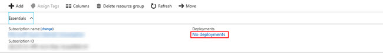

## Overview
Before we jump in to building our virtual network, let's take a little bit of time exploring Resource Groups.  In this section, we're going to explore some of the predominant features of Resource Groups.

!! <h4>Note</h4> Much of the following sections will initially be empty in Azure as we've not created any resources in our Resource Group.  That's okay; we'll come back to them later.  The next few pages exist to simply provide an introduction.

Once we've created our Resource Group, or whenever we select a Resource Group in Azure, the first blade we are directed to is the **Overview**.  The Overview blade does just that - gives us an overview of the resources that our Resource Group contains.  Here, we can add resources, delete resources and move resources to other groups or subscriptions.

## Deployments
One thing to notice on this blade is **Deployments**. Every time we add or remove a set of resources in batch, this is considered a "deployment".

What is a batch? If we were to simply add a single network card to our resource group, that would be considered a batch or _deployment_.  On the other hand, deploying a virtual machine, which would not only be the VM, itself, but it could also include a network interface (NIC), an IP address, a storage account, etc.  The process of deploying a VM could potential require adding a few resources in a single deployment.

As we deploy more and more resources to our Resource Group, we can see the deployment history.  This is useful for, among other reasons, auditing and change management.

We will come back to this blade later to add our Virtual Network.