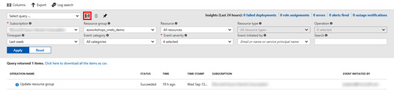
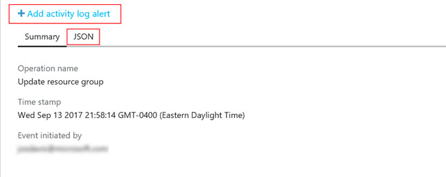
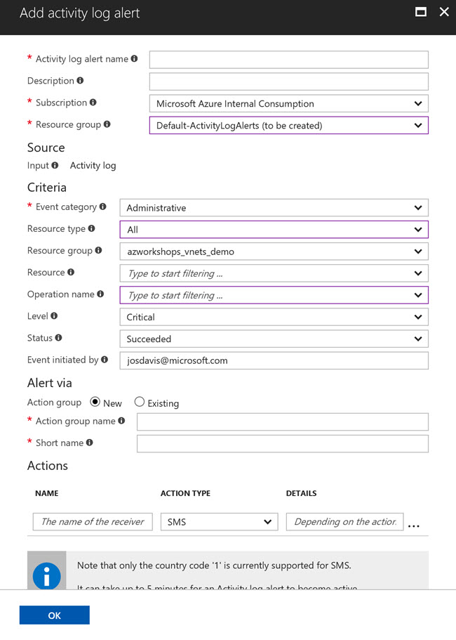

## Overview
Let's briefly explore how to query the history around our Resource Group.

## Activity Log
Once you've created a Resource Group or you click on a Resource Group, the first tab **Overview** is selected.  Of course, there's no resources created yet.  We'll create some momentarily.  For now, in the left panel, click on **Activity log** .

The Activity Log gives you a report of all events within your Resource Group.  At the top of the query window, you'll see various options to customize your query.  Additionally, you can choose to save frequent search parameters.



There's, of course, not much to see here are this time. But, as we complete this workshop, you can revisit this blade periodically to see the changes to your Resource Group.

## Exploring the Log
By default, the query looks at all events in the past 6 hours.  You should see an operation entitled _Update resource group_ referring to the creation of the Resource Group.  If you don't see this event, try increasing the **Timespan** and click **Apply**.

Once you see the event listed, go ahead and click on the first event, **Update resource group**.

Clicking on the event will reveal an information window at the bottom of the screen.  The information window initially shows you the same basic information that the log table showed.  However, there are two other features exposed by this window.



### Log Details
Clicking on the **JSON** "tab" will display the details of the log entry in a JSON format.  Looking through this JSON object, you can find a vast amount of different information regarding the event.  Such information includes the action performed, the person performing the action, originating IP address, log level, resource type(s), resource location(s), and subscription Id.  All of this information can be used to create automated alerts in Azure.

### Alerts
The second feature of the details window enables you to create alerts around specific events. In the details window, clicking on **Add activity log alert** will open a new blade to create an alert.



Let's create an informational alert.

In the alert blade, enter the following information:

  1. Basics
     * Activity log alert name: **VNet Info Alert**
     * Description: **Informational alert for resource group**
     * Subscription: **_&lt;choose your subscription&gt;_**
     * Resource group: **_&lt;accept the default&gt;_** (this will create a new resource group for alerts)

  2. Source
     * Input: **_&lt;Activity log&gt;_**

  3. Criteria
     * Event category: **Administrative**
     * Resource type: **All**
     * Resource group: **_&lt;azworkshops_vnets_demo&gt;_**
     * Resource: **All**
     * Operation name: **All**
     * Level: **All**
     * Status: **All**
     * Event initiated by: **_&lt;accept the default&gt;_**

  4. Alert via
     * Action group: **New**
     * Action group name: **Information Alerts**
     * Short name: **info** (include the greater and less than signs)

  5. Actions  
     Here, add two actions - one for your email address and another for your mobile phone (SMS).  
     
     **IMPORTANT:** The _name of the receiver_ must by **unique**.  Therefore, for your emaill address and SMS, name the receiver with a differentiator (e.g. "John Doe - Email", "John Doe - SMS").
     
     Notice that you can also specify a _Webhook_ (URL) if you want to automate a notification or ticket in your support application, such as _ServiceNow_.

  6. Click **OK**.

It should only take a couple of seconds to create the Resource Group (if necessary) and create/update the Action Group.  Once the process has completed you should receive a text (SMS) message and an email - provided that you set up both actions - alerting you that you've been added to the Action Group.

## Powershell/CLI
Before we move forward in looking at the other options of our Resource Group, let's interact with the Activity Logs just a bit more.  This time we'll query the logs using Powershell and/or the CLI.  As a reminder, most people use Powershell in a Windows environment and the CLI in Linux-based environment, but either can be used on any environment.  

Both of the following sections are the same.  Simply use the environment with which you feel most comfortable.

### Powershell

  1. From your prompt connect to Azure:
     ```ps
     login-azurermaccount
     ```

  2. Make sure you are "attached" to the correct subscription. If you only have one subscription, it will automatically be chosen for you.  However, if you have more than one subscription, then the incorrect one may have been chosen by default.

     1. List all subscriptions:
        ```ps
        get-azurermsubscription | select -Property SubscriptionName
        ```

     2. Set the active subscription:
        ```ps
        select-azurermsubscription -SubscriptionName "<your subscription name>"
        ```

  3. Let's get _all_ of the log entries for our Resource Group:
     ```ps
     get-azurermlog -ResourceGroup azworkshops_vnets_demo
     ```
     You should see a couple of entries here, if nothing else, regarding the creation of the Resource Group.

  4. Now, let's get _all_ of the log entries where the _Status_ is **succeeded**:
     ```ps
     get-azurermlog -ResourceGroup azworkshops_vnets_demo -Status Succeeded
     ```
     This is helpful when you want to query any log entries where an operation may have **failed**.

  5. You can also specify a date range and a person who performed the action:
     ```ps
     get-azurermlog -ResourceGroup azworkshops_vnets_demo -StartTime (Get-Date).AddDays(-14) -Caller <your email address>
     ```
     This queries all actions performed in the last two weeks by you.  If you want to specify a right boundary on your time frame, then you can use the `EndTime` parameter.

  6. Finally, to display all of the JSON-formatted details that you saw earlier in the details window, add the `DetailedOutput` parameter:
     ```ps
     Get-AzureRmLog -ResourceGroup azworkshops_vnets_demo -Status Succeeded -DetailedOutput
     ```

### CLI

  1. From your prompt connect to Azure:
     ```bash
     azure login
     ```
     You will need to visit `https://aka.ms/devicelogin` and enter the code that the CLI gives you.

  2. Make sure you are "attached" to the correct subscription. If you only have one subscription, it will automatically be chosen for you.  However, if you have more than one subscription, then the incorrect one may have been chosen by default.

     1. List all subscriptions:
        ```bash
        azure account list | awk -F' {2,}' '{print $2}'
        ```
        (NOTE: You can simply issue the `azure account list` command to show all subscriptions _and_ other details. However, in a Linux-based environment, the above command will strip out all of the other information and show the subscription names only.)

     2. Set the active subscription:
        ```bash
        azure account set "<your subscription name>"
        ```

  3. Let's get _all_ of the log entries for our Resource Group:
     ```bash
     azure group log show azworkshops_vnets_demo -a
     ```
     You should see a couple of entries here, if nothing else, regarding the creation of the Resource Group.  

     (**NOTE:** The `-a` parameter for "all" entries is optional.  However, remember from above that, by default, only the past 6 hours are queried from the log.  So, if you want anything beyond that, you'll need to specify this parameter.)

  4. Now, let's get _all_ of the log entries where the _Status_ is **succeeded**.  The CLI doesn't have a querying option, so we'll need to convert the output to JSON then filter that output using `jq`. The _Status_ is a property of the objects returned from the Azure Insight SDK.  The _Status_ property has a property of its own called _Value_.  For accessing these properties and filter by them, we'll use 'dot' notation:
     ```bash
     azure group log show azworkshops_vnets_demo -a --json | jq '.[] | select(.status.value == "Succeeded")'
     ```
     The command takes all of our returned data and, using `jq`, converts it to a JSON array of objects, then filters and displays only objects whose property _Status.Value_ equals "Succeeded".  This is helpful when you want to query any log entries where an operation may have **failed**.

  5. You can also filter by date range and a person who performed the action:
     ```bash
     azure group log show azworkshops_vnets_demo -a --json | jq --arg startTime $(date --date="14 days ago" -Is) '.[] | select(.eventTimestamp > $startTime and .caller == "<your email address>")'
     ```
     This queries all actions performed in the last two weeks by you. Looking at this, what we're doing is passing an argument `startTime` in to `jq`.  The value of `startTime` is calculated by running a _nested_ command `$(date --date="14 days ago" -Is)`.  That value is then used by `jq` to compare to the `eventTimestamp` property of our returned log entries.
  
     If you want to specify a right boundary on your time frame, then you can create an additional argument and condition.

     (**NOTE:** Mac's do not support the `--date` or `-I` parameter.  Instead, your nested command should be `$(date -v-14d +%Y-%m-%dT%H:%M:%S%z)` where the `-v` subtracts 14 days and the output is formatted.)

Wow! That was a lot of interaction with our Activity Logs.  However, understanding how to use Activity Logs is _extremely_ beneficial for many reasons.  Those logs can later be audited, piped, or used for reporting in platforms such as Operations Management Suite (OMS).  While this may have seemed like a lot of work, it will get easier over time and it's highly recommended that you continue to practice with the logs and become familiar with them.