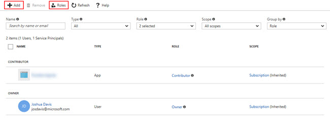
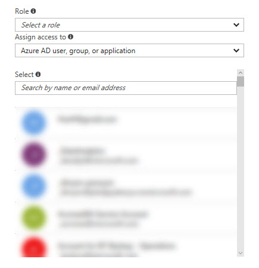
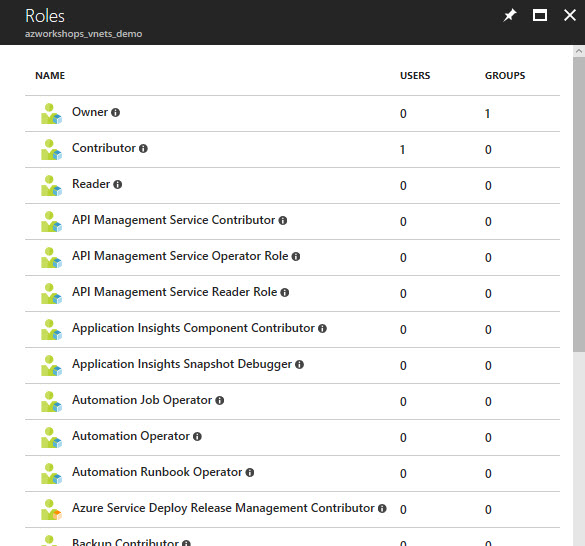

## Overview
We're briefly going to discuss how to secure our group and it's resources by utilizing Azure's RBAC capabilities.

## Access Control (IAM)
The Access Control blade is the management interface enabling you to leverage Azure's Identity and Access Management (IAM). Azure's IAM is used to secure your cloud resources, whether that's a group, as a whole, or individual resources.  Azure's IAM follows the common permissions model of Role Based Access Control (RBAC) which is a method of controlling access to resources based on the roles of the individual users within the enterprise.

By default, this view shows all explicitly assigned roles/users who have access to this resource.  In our case, this is for our resource group with which we're currently working (e.g. _azworkshops_vnets_demo_).



In the sample image, you'll see that I have two types of users with assigned roles to my resource group.  In the far most right corner, you'll see that these two users were _inherited_ from the subscription level.  Therefore, we know that these two users were added to a policy at the subscription and those roles have been "passed down" to the child resources of the subscription.

The first user is a _Contributor_ while the second user is an _Owner_.  A Contributor pretty much has full rights to a resource, but cannot grant/revoke access.  An Owner, on the other hand, can do whatever they please, including management of access.

Finally, in the second column we see the user's _type_.  The second user is a standard user account in Active Directory.  The first user, on the other hand, is described as an _app_.  What that means is that our first user is a registered application, also known as a _Service Principal_.  This registered application has been assigned a Contributor role to all of the resources within our subscription.  Therefore, the application itself can interact and manage our subscription.

### Adding Users
At the top of the blade, you will see **Add**.  Clicking on this will reveal something similar to the following configuration blade.



By expanding the dropdown for _Role_, you'll see that there are over 60 different roles available for assignment to users and/or groups.  Each role allows the user(s) to perform specific tasks within Azure and it's resources.  If you are interested in learning about each specific role, checkout the [Azure docs](https://docs.microsoft.com/en-us/azure/active-directory/role-based-access-built-in-roles).

You have the ability to decide whether you desire to grant access to an Azure AD user, group, or application; or, you may grant access to a virtual machine. 

If you choose a virtual machine, a few other settings will appear allowing you to choose the virtual machine.  If not, you can simply choose a current user in Active Directory, a Service Principal, a Service Account, or enter someone's email address to give access outside of your Active Directory.

### Viewing Roles
Azure also provides a way to very easily see what users and/or groups have been assigned to what roles.  Returning to the main **Access Control (IAM)** blade and clicking on **Roles** will display a table of all the roles along with a count of how many users and groups have been assigned to that role.



Clicking on any one of these roles will display the assigned users and groups to that particular role.

## Powershell/CLI
We are can use Powershell and the CLI to work with RBAC, as well.  I won't get into _assigning_ or _removing_ users from roles in this workshop as we don't have any other users.  But, we will experiment with querying our RBAC policies.  Just as we did on the previous page, we will practice using Powershell and the CLI.  Based on your environment and needs, you can choose which tool to use as both of the following sections are the same.

### Powershell

  1. From your prompt connect to Azure:
     ```ps
     login-azurermaccount
     ```

  2. Make sure you are "attached" to the correct subscription. If you only have one subscription, it will automatically be chosen for you.  However, if you have more than one subscription, then the incorrect one may have been chosen by default.

     1. List all subscriptions:
        ```ps
        get-azurermsubscription | select -Property SubscriptionName
        ```

     2. Set the active subscription:
        ```ps
        select-azurermsubscription -SubscriptionName "<your subscription name>"
        ```
  3. Let's list RBAC roles that are available for assignment and inspect the operations to which they grant access:
     ```ps
     get-azurermroledefinition | FT Name, Description
     ```

  4. Let's list the available actions for a given role:
     ```ps 
     get-azurermroledefinition "Contributor" | FL Actions, NotActions

     (get-azurermroledefinition "Virtual Machine Contributor").Actions
     ```  
     
     The first command shows all of the actions and "not-actions" (e.g. allow and deny) for the _Contributor_ role.  The second command shows what actions someone who has the _Virtual Machine Contributor_ is allowed to perform.

  5. Show role assignments for the resource group:
     ```ps
     get-azurermroleassignment -ResourceGroupName azworkshops_vnets_demo | FT DisplayName, RoleDefinitionName, Scope
     ```

  6. Show roles assigned to a specific user:
     ```ps
     get-azurermroleassignment -SignInName <your email address> | FT DisplayName, RoleDefinition, Scope

     get-azurermroleassignment -SignInName <your email address> -ExpandPrincipalGroups | FT DisplayName, RoleDefinition, Scope
     ```

     The first command shows all roles assigned to the user _explicitly_. The second command shows all roles _inherited_ by the user due to their membership in group.

### CLI

  1. From your prompt connect to Azure:
     ```bash
     azure login
     ```
     You will need to visit `https://aka.ms/devicelogin` and enter the code that the CLI gives you.

  2. Make sure you are "attached" to the correct subscription. If you only have one subscription, it will automatically be chosen for you.  However, if you have more than one subscription, then the incorrect one may have been chosen by default.

     1. List all subscriptions:
        ```bash
        azure account list | awk -F' {2,}' '{print $2}'
        ```
        (NOTE: You can simply issue the `azure account list` command to show all subscriptions _and_ other details. However, in a Linux-based environment, the above command will strip out all of the other information and show the subscription names only.)

     2. Set the active subscription:
        ```bash
        azure account set "<your subscription name>"
        ```

  3. Let's list RBAC roles that are available for assignment and inspect the operations to which they grant access:
     ```bash
     azure role list --json | jq '.[] | {"name":.Name, "description":.Description}'
     ```

  4. Let's list the available actions for a given role:
     ```bash
     azure role show "contributor" --json | jq '.[] | {"Actions":.Actions,"NotActions":.NotActions}'

     azure role show "virtual machine contributor" --json | jq '.[] | .Actions'
     ```  
     
     The first command shows all of the actions and "not-actions" (e.g. allow and deny) for the _Contributor_ role.  The second command shows what actions someone who has the _Virtual Machine Contributor_ is allowed to perform.

  5. Show role assignments for the resource group:
     ```bash
     azure role assignment list --resource-group azworkshops_vnets_demo --json | jq '.[] | {"DisplayName":.properties.aADObject.displayName, "RoleName":.properties.roleName, "Scope":.properties.scope}'
     ```

  6. Show roles assigned to a specific user:
     ```bash
     azure role assignment list --signInName <your email address> --json | jq '.[] | {"DisplayName":.properties.aADObject.displayName,"RoleDefinitionName":.properties.roleName,"Scope":.properties.scope}'

     azure role assignment list --signInName <your email address> --expandPrincipalGroups --json | jq '.[] | {"DisplayName":.properties.aADObject.displayName,"RoleDefinitionName":.properties.roleName,"Scope":.properties.scope}'
     ```

     The first command shows all roles assigned to the user _explicitly_. The second command shows all roles _inherited_ by the user due to their membership in group.

This introduction to RBAC should be sufficient in managing access to your Azure resources.  Again, you can perform a lot more management via Powershell or the CLI, but for the purposes of this workshop, the Azure GUI will work just fine.